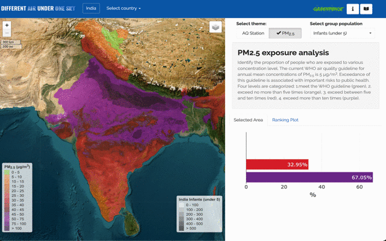

# DIFFERENT AIR UNDER ONE SKY 

A multi-country air quality monitoring web application built with R Shiny, deployed on Google Cloud Platform.

## 🌍 Live Demo
- [Project Website](https://maps.greenpeace.org/projects/apu_dashboard/?country=India)
- Available for: India, Indonesia, Malaysia, Philippines, South Africa, Thailand, Turkey, Colombia

## ✨ Features
- Interactive maps showing air quality data by administrative regions
- Population exposure analysis to air pollution
- Distance-based analysis from air quality monitoring stations
- Responsive design with multiple visualization options
- Country-specific data and boundaries

## 🛠 Tech Stack
- **Frontend**: R Shiny, Leaflet.js, Plotly
- **Backend**: R with spatial data processing
- **Deployment**: Docker + Google Cloud Run
- **Data**: Geospatial analysis with sf, raster packages

## 📊 Screenshots

*Interactive air quality monitoring dashboard*

## 🚀 Local Development
```bash
# Clone the repository
git clone [https://github.com/MiaoChien0204/under-one-sky.git]

# Navigate to a country folder
cd Indonesia-L1/

# Run in R
R
> shiny::runApp()
```

## 🐳 Docker Deployment
```bash
# Build image
docker build -t under-one-sky:latest .

# Run locally
docker run --rm -p 9999:80 --name under-one-sky under-one-sky:latest

# Visit http://localhost:9999/
```


## 📁 Project Structure
```
├── Indonesia-L1/          # Country-specific Shiny apps
├── India-L1/
├── [other countries]/
├── Template/              # Base template for new countries
├── Dockerfile            # Container configuration
└── index.html           # Landing page
```

## 💼 About This Project
This project demonstrates:
- **Full-stack web development** with R Shiny
- **Geospatial data analysis** and visualization
- **Cloud deployment** with Docker and GCP
- **Multi-tenant architecture** supporting multiple countries
- **Responsive design** for environmental data presentation

Developed as part of environmental monitoring initiatives, showcasing technical skills in data visualization, cloud deployment, and scalable web application architecture.

## 🤝 Contributing
This project was developed for environmental monitoring purposes. Feel free to fork and adapt for other regions.

## 📄 License
MIT License
